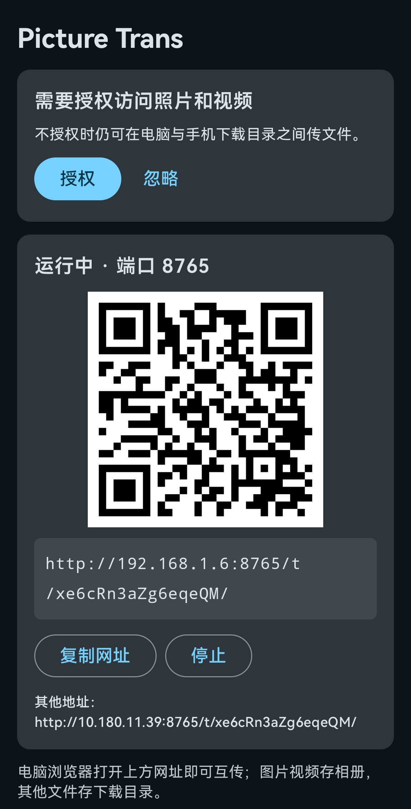

# Picture Trans

Transfer files between your Android phone and computer over the same local network (LAN) — no USB cable, no cloud, no PC-side installation.

```
phone (Picture Trans)                         computer
+---------------------------+                +----------------------+
| Compose UI                |                | any browser          |
|  - QR code + URL          |                |  - no install needed |
|  - transfer progress      |                |  - download/upload   |
+---------------------------+                +----------+-----------+
| Ktor CIO HTTP server      |<---- LAN / HTTP --------->|
|  /t/<token>/  (404 else)  |                drag & drop, Range GETs
|  MediaStore repository    |
+---------------------------+
```

## What it does

- The phone runs a built-in HTTP server (Ktor/CIO) and shows a URL + QR code
- Open the URL on your computer's browser (scan the QR code, or type it in)
- **Phone → PC**: browse and download photos, videos, and Download-folder files
- **PC → Phone**: drag & drop upload — images/videos go to your gallery, other files go to Downloads
- Video preview with seek support (HTTP Range), thumbnail grid, multi-select download
- Transfer progress and history shown live on the phone
- Access token in the URL path (`/t/<token>/`) keeps out other LAN devices

## Screenshots

Real-device capture (2026-09-12): the phone hosts the server and shows
the URL + QR code to open on the computer.



## Requirements

- Android 8.0+ (API 26+)
- Phone and computer on the same WiFi / hotspot
- Computer browser: any modern browser (Chrome/Edge/Firefox/Safari)

No server-side app needed — the computer only uses a browser.

## Build

```bash
# Prerequisites: JDK 17+, Android SDK (platform 35)
./gradlew assembleDebug          # debug APK
./gradlew assembleRelease        # release APK (uses keystore.properties if present, else debug-signed)
```

Prebuilt APKs:
- `dist/app-debug.apk` — debug build
- `dist/app-release.apk` — release build (debug-signed fallback, sideloadable)

## Install

1. Copy the APK to your phone (USB, LAN, or direct download)
2. Enable "Install unknown apps" for your file manager / browser
3. Install and open the app
4. Grant photo/video access (optional — needed to browse them from the PC)
5. Tap **启动** (Start), connect phone & PC to the same WiFi
6. Scan the QR code on the computer, or type the shown URL

## Usage

| Action | How |
|---|---|
| Phone → PC (photos/videos) | Open the URL → 图片/视频 tab → click ⬇ or select + 下载所选 |
| Phone → PC (files) | 文件 tab shows Download-folder contents |
| PC → Phone | 上传 tab → drag files or click to select |
| Check transfer progress | On the phone app home screen (live + history) |
| Change port | Stop server → edit port field → Start again |

## Privacy & security

- LAN-only: the server listens on `0.0.0.0`, reachable only inside the local network
- Random 16-char token per install: URL path is `http://<ip>:<port>/t/<token>/` — devices without the token get 404
- Plain HTTP inside the LAN is a deliberate trade-off (no cert burden); do not expose the port to the public internet
- Files are stored locally; nothing is uploaded to any cloud

## Project layout

```
app/src/main/java/com/xieguiawu/picturetrans/
├── server/       Ktor HTTP server, token guard, web UI page, process-level runner
├── media/        MediaStore repository (API 26/29/33 branches), models, permissions
├── transfer/     Live progress & history tracker (thread-safe StateFlow)
├── ui/           Compose UI: server card, QR code, progress, history
├── util/         Token store, filename sanitizer, counting input stream
├── net/          LAN IPv4 enumeration
└── qr/           ZXing QR generation
```

## Tests

30 JVM/Robolectric tests, including a real-socket end-to-end suite:

```bash
./gradlew testDebugUnitTest
```

- `ServerE2eTest` — starts a real CIO server on a random port, verifies auth 404s, listing, exact-byte download, Range 206, multipart upload, filename sanitization
- `MainActivitySmokeTest` — Robolectric entry-point launch ("app starts and shows UI")
- Unit tests for token guard, filename sanitizer, transfer tracker, network utils

## Limitations / roadmap

- Server runs while the app is open (screen-off stops it — foreground service is future work)
- Old devices (API 26–28) need the legacy per-file permission path
- No folder browsing beyond the Download directory (MediaStore-based listing)
## F-Droid

**Submitted (2026-09-12)** — [fdroiddata MR !48684](https://gitlab.com/fdroid/fdroiddata/-/merge_requests/48684),
in review. (The fork's CI shows "failed" with zero jobs — a fresh-account
identity-verification gate, not a metadata problem; `fdroid lint` passes locally.)
`docs/fdroid/` keeps the metadata draft, MR patch and submission guide as a record.

- No `AntiFeatures` are declared — unlike the author's other apps, this one
  depends on no proprietary network service. Don't copy another app's yml.
- Store metadata: `fastlane/metadata/android/{en-US,zh-CN}/`
- Screenshots are real-device captures (2026-09-12). (A Robolectric render
  test also exists, kept for regression:

  ```bash
  ./gradlew :app:testDebugUnitTest --tests "*StoreScreenshotsTest" -PstoreScreenshots
  ```

- Store icon is rendered from the live adaptive-icon vector:
  `python3 scripts/render-icon.py`
- Pre-flight check: `bash scripts/validate-fdroid-metadata.sh`
